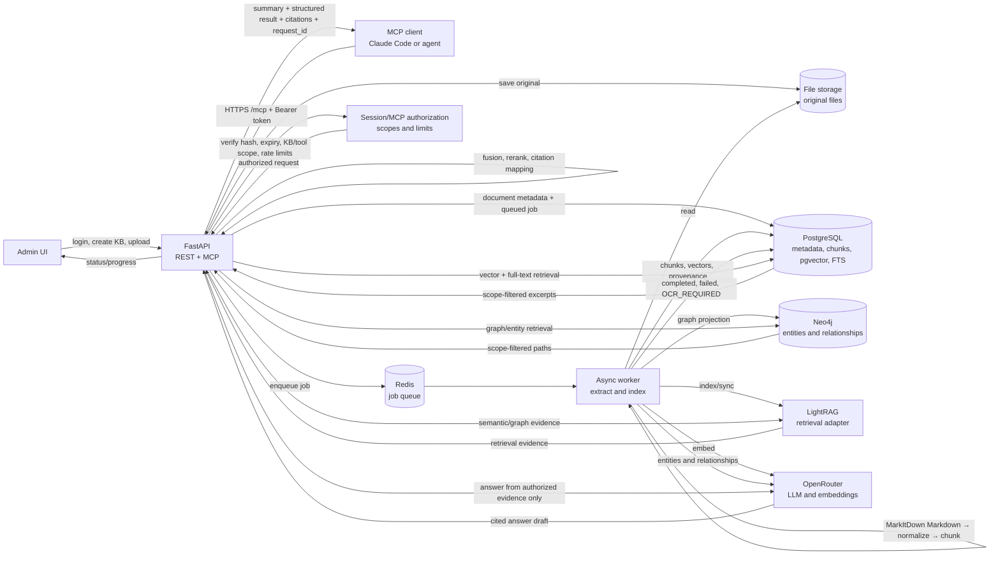

# Softnix Knowledge Intelligence Platform

Production-oriented MVP for document knowledge management, retrieval evidence, citations, and remote MCP tools.

## Quick start

```bash
cp .env.example .env
docker compose up --build
```

Open the web UI at the port configured by `WEB_PORT` (default `http://localhost:8081`), sign in with the initial-admin credentials from `.env`, create a knowledge base, upload a supported document, then use the Query Playground. The API is available at `http://localhost:8001`, health at `/health`, and MCP at `/mcp`.

For development, set `OPENROUTER_API_KEY` in `.env`. Docker Compose starts LightRAG with OpenRouter as its initial LLM and embedding provider; verify its credentials after login through `POST /api/v1/system/test-openrouter`.

See [deployment](docs/DEPLOYMENT.md), [API](docs/API.md), [MCP](docs/MCP.md), [security](docs/SECURITY.md), [architecture](docs/ARCHITECTURE.md), and the [high-level data flow](docs/DATA_FLOW.md).

## Data flow

The platform separates document ingestion from query serving. Upload requests are acknowledged quickly, while the worker performs extraction and indexing asynchronously. Queries are scope-filtered before any answer is generated.



### Flow stages

1. **Upload** — the API authenticates the administrator, validates file type and size, calculates a checksum, rejects duplicates, stores the original file, and creates a queued processing job.
2. **Asynchronous processing** — Redis hands the job to the worker. Microsoft MarkItDown converts a validated local file into structured Markdown, then the worker normalizes it, chunks it, creates embeddings through OpenRouter, and records provenance. A PDF with no usable text layer is sent to the configured external OCR v3 service and its Markdown result returns to the same pipeline; without configured OCR it remains `OCR_REQUIRED`.
3. **Indexing** — chunks and vectors are stored in PostgreSQL, full-text search is maintained there, entities and relationships are projected to Neo4j, and the LightRAG adapter is synchronized.
4. **Processing result** — the document becomes `completed`, `failed`, or `OCR_REQUIRED`. The UI polls while work is active and links directly to document details, Search, and Explore graph when ready.
5. **MCP query** — an MCP client sends a bearer token to `/mcp`. The API verifies the token hash, expiry, revocation state, Knowledge Base scope, allowed tool, rate limit, concurrency, and timeout.
6. **Retrieval and answer** — the planner runs permitted vector, full-text, graph, and LightRAG retrieval in parallel. Results are fused and mapped to citations; OpenRouter receives only scope-filtered evidence and generates the final answer.
7. **Response** — MCP returns a text summary, structured result, citations, and a request ID for tracing and audit.

Agent-facing MCP contracts are bounded and typed: `tools/list` exposes JSON schemas, token scope is authoritative (client KB arguments cannot broaden it), and legal agents can use `resolve_legal_context`, `get_legal_instrument`, and `get_provision_history`. These tools are read-only, return provenance/review status and safe retrieval traces, and never promote unresolved legal relations to verified facts.

Observability uses normalized `trace_runs` and `trace_spans` as the hot Trace Explorer index while retaining redacted `AuditLog` records for compatibility and compliance. Trace APIs support cursor pagination and time filters; the worker prunes high-volume request/retrieval/MCP events according to the configured retention windows.

Each Knowledge Base exposes a versioned retrieval policy at `PATCH /api/v1/knowledge-bases/{id}/retrieval-config`. Rule-first planning selects an intent and only an ambiguous query uses the constrained OpenRouter planner fallback. The response metadata and MCP activity view expose the selected plan and actual channel trace; planner logs never contain bearer tokens or request headers.

### MarkItDown extraction

The ingestion pipeline accepts PDF, DOCX, PPTX, XLSX/XLS, TXT, Markdown, HTML, CSV, and JSON (up to the configured upload limit). MarkItDown runs only against the stored local file with built-in converters and plugins, OCR, LLM, URLs, ZIPs, and cloud integrations disabled. Its Markdown output is the canonical extracted content used by search, citations, graph extraction, and legal metadata; the original file remains unchanged as the source record. Existing local parsers are used only as a compatibility fallback for previously supported file types.

For scanned PDFs, set `EXT_OCR_KEY` to enable the Softnix external OCR v3 adapter. The worker submits only the stored PDF over TLS, requests Markdown-only output (`disable_structure=true`), records progress under `external_ocr_*`, and continues normal indexing from `combined_markdown`. The adapter does not request provider-side structured extraction, webhook callbacks, plugins, or model listing. `EXT_OCR_VERIFY_SSL=false` is provided for the current IP/self-signed endpoint and should be changed to `true` after a valid certificate is deployed.

### Data boundaries

- Original documents never go to the query client; they remain in the configured file-storage volume.
- PostgreSQL is the source of truth for document metadata, chunks, vectors, jobs, tokens, query results, and audit records.
- Neo4j stores graph entities and relationships used for graph and impact analysis.
- MCP tokens are stored hash-only. Raw token values are shown once at creation time.
- OpenRouter is an external processing dependency. Prompts are bounded by authorized evidence and document content is treated as untrusted input.

## Legal document extraction

For a completed document, an administrator can request structured legal metadata from the document details panel or API:

```http
POST /api/v1/documents/{document_id}/legal-extract
```

The request creates an asynchronous `EXTRACT_LEGAL_METADATA` job. Legal Graph Schema v2 stores a `LegalInstrument`, document-scoped `provisions`, parties, obligations, rights, prohibitions, penalties, definitions, amendments, and explicit cross-document `references`. Every projected fact has an evidence quote and document provenance. The legacy `articles` field remains readable for compatibility while new extraction writes `provisions`.

Administrators can review and maintain the metadata from the document details panel or API. `PUT /api/v1/documents/{document_id}/legal-metadata` replaces the structured object, `PATCH /api/v1/documents/{document_id}/legal-metadata` merges top-level fields (useful for adding an article or amendment), and `DELETE /api/v1/documents/{document_id}/legal-metadata` clears it. All changes are recorded in the audit log.

The upload form includes a **Document type** choice. Select **Legal document**, **Regulation / policy**, or **Contract** to preserve that classification and automatically queue legal-schema extraction after the document has been extracted, chunked, embedded, and indexed. The document stays searchable if legal extraction later fails; the extraction job records the error for review. **General document** keeps the standard knowledge-processing flow.

### Legal Graph review

Explore Graph opens **Verified legal structure** by default. It separates deterministic document structure from **Suggested relationships** such as `ISSUED_UNDER` and `IMPLEMENTS`. Suggestions are created only from explicit evidence, remain unavailable to impact analysis until an administrator approves them, and retain their excerpt, source document, confidence, reviewer, and audit trail. Use `POST /api/v1/knowledge-bases/{kb_id}/legal-graph/rebuild` to queue an idempotent rebuild; it replaces only system-generated legal graph data and preserves manual graph work.

It is an information-extraction aid, not legal advice; reviewers must verify every extracted item against the source document. Scanned PDFs still require OCR before legal extraction can run.

A legal document's chunks are split on มาตรา/ข้อ/หมวด headings rather than fixed character windows, so each chunk carries its own section identity (`section_kind`, `section_number`, `section_label`); a cross-reference such as "ให้เป็นไปตามมาตรา 15" mid-sentence never starts a spurious new section.

### Legal registry: temporal and authority-aware retrieval

Beyond the graph, every legal/regulation/contract document gets a **legal registry** entry: a rule-based kind (พระราชบัญญัติ, กฎกระทรวง, ประกาศ, ระเบียบ, ...) with an authority level, a family grouping it with its amendments, effective_from/effective_to, and a status (`in_force`, `amended`, `superseded`, `repealed`, `not_yet_effective`, `unknown`). The status is resolved deterministically — no LLM call — from reviewed AMENDS/REPEALS/SUPERSEDES relationships; an administrator's manual override at `PATCH /api/v1/legal-instruments/{id}` always wins and is never recomputed.

Queries against a Knowledge Base with a legal registry get:

- **Version resolution** — `filters.as_of_date` (default today) selects the instrument version that was in force at that date; `filters.include_historical` disables exclusion to compare every version.
- **Weighted ranking** — fused evidence is boosted by authority level, legal status, and recency, tunable per Knowledge Base via `PATCH /knowledge-bases/{id}/retrieval-config` (`authority_weight`, `status_weight`, `recency_weight`, `legal_awareness`, `exclude_invalid`).
- **Conflict detection** — duplicate provisions across versions collapse to the current one, and citations returned to the client and the LLM carry the resolved status, authority level, version label, and effective dates so an answer never silently mixes a repealed provision with its replacement.

A Knowledge Base with no legal documents is completely unaffected: the resolver finds nothing to match and every weight multiplies against an empty registry.
