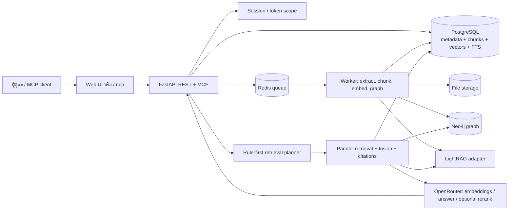

# Softnix Knowledge Intelligence

แพลตฟอร์มจัดการเอกสารและค้นคืนความรู้แบบมีหลักฐานอ้างอิง (citation) สำหรับผู้ดูแลระบบและ MCP/AI agent

## เริ่มใช้งานอย่างย่อ

```bash
cp .env.example .env
# แก้ APP_SECRET_KEY, TOKEN_HASH_SECRET, INITIAL_ADMIN_PASSWORD และ OPENROUTER_API_KEY
docker compose up --build
```

- Web UI: `http://localhost:8081` (ปรับด้วย `WEB_PORT`)
- REST API: `http://localhost:8001` (ปรับด้วย `API_PORT`)
- ตรวจสุขภาพ: `/health` และ `/ready`
- MCP: `/mcp`

เข้าสู่ระบบด้วยค่าจาก `INITIAL_ADMIN_USERNAME`/`INITIAL_ADMIN_PASSWORD` ใน `.env` จากนั้นสร้าง Knowledge Base, อัปโหลดเอกสาร และใช้ Query Playground ได้ทันที

> ระบบจะสร้างผู้ดูแลเริ่มต้นเฉพาะตอนยังไม่มีบัญชีเท่านั้น การเปลี่ยนค่าใน `.env` ภายหลังจะไม่รีเซ็ตรหัสผ่านเดิมโดยอัตโนมัติ

## ภาพรวมการทำงาน



ดูไดอะแกรมและขอบเขตข้อมูลฉบับเต็มที่ [High-level Data Flow](docs/DATA_FLOW.md) และรายละเอียดส่วนประกอบที่ [Architecture](docs/ARCHITECTURE.md)

## การนำเข้าเอกสาร

Web/API รองรับ PDF, DOCX, PPTX, XLSX/XLS, TXT, Markdown, HTML, CSV และ JSON ตามขนาด `MAX_FILE_SIZE_MB` ค่าเริ่มต้น 100 MB

1. API ตรวจสิทธิ์, MIME/type, ขนาด และ SHA-256 กันไฟล์ซ้ำ แล้วเก็บไฟล์ต้นฉบับนอก web root
2. Worker แปลงเป็น Markdown ด้วย MarkItDown, normalize, แบ่ง chunk และสร้าง embedding
3. เก็บ metadata, chunk, vector, full-text และ provenance ใน PostgreSQL พร้อมฉาย graph ไป Neo4j และ sync ดัชนี LightRAG
4. PDF สแกนที่ไม่มี text layer จะเป็น `OCR_REQUIRED` หากไม่ได้ตั้งค่า OCR ภายนอก

เอกสารสามารถระบุ `published_at` (`YYYY-MM-DD`) ตอนอัปโหลดหรือแก้ไขภายหลังได้ วันที่นี้ใช้กรองข่าวตามเดือน/ปี และเอกสารที่ไม่มีวันที่จะไม่ผ่าน query ที่มี date filter

### OCR สำหรับ PDF สแกน

ระบบตรวจ text layer โดยแปลงด้วย MarkItDown (fallback เป็น pypdf) แล้วนับจำนวนตัวอักษรจริง หากได้น้อยกว่า 20 ตัวจะถือว่าเป็น PDF สแกนที่ไม่มี text layer

- **ไม่ได้ตั้งค่า `EXT_OCR_KEY`**: เอกสารค้างที่สถานะ `ocr_required` ถาวร (ไม่ chunk/embed/index ต่อ) จนกว่าจะอัปโหลดใหม่หรือแอดมินตั้งค่า OCR แล้ว reindex
- **ตั้งค่า `EXT_OCR_KEY` แล้ว**: worker ส่งไฟล์ไปยัง external OCR service (Softnix OCR v3) ผ่าน `EXT_OCR_BASE_URL`, poll สถานะทุก `EXT_OCR_POLL_INTERVAL_SECONDS` วินาที (default 2s) จนกว่าจะเสร็จหรือครบ `EXT_OCR_PROCESSING_TIMEOUT_SECONDS` (default 300s) แล้วนำ Markdown ที่ได้เข้า pipeline ปกติ (chunk → embed → index)
- ความล้มเหลวชั่วคราวของ external OCR (`EXTERNAL_OCR_UNAVAILABLE`, `EXTERNAL_OCR_TIMEOUT`) จะ retry อัตโนมัติสูงสุด 3 ครั้งตาม backoff ของ processing job
- ตัวแปรที่เกี่ยวข้อง: `EXT_OCR_KEY`, `EXT_OCR_BASE_URL`, `EXT_OCR_ENGINE` (default `tesseract`), `EXT_OCR_IMAGE_SIZE`, `EXT_OCR_VERIFY_SSL`, `EXT_OCR_REQUEST_TIMEOUT_SECONDS`, `EXT_OCR_PROCESSING_TIMEOUT_SECONDS`, `EXT_OCR_POLL_INTERVAL_SECONDS` — ดูค่า default ที่ `apps/api/app/config.py` และตั้งค่าใน `.env` ก่อนใช้งานจริง (ค่า default ของ `EXT_OCR_BASE_URL` เป็น endpoint ตัวอย่างเท่านั้น และ `EXT_OCR_VERIFY_SSL=false` โดย default ควรพิจารณาเปิดใน production)

## Auto Retrieval Strategy

Planner ใช้กฎ deterministic ก่อนเสมอ และใช้ LLM fallback เฉพาะคำถามที่ไม่เข้ากฎ โดยส่งแผนและ trace กลับใน `metadata`

| รูปแบบคำถาม | แผนหลัก |
|---|---|
| ขั้นตอน / how-to / VPN | Vector + Full-text |
| entity เช่น `APP-01` และถามความสัมพันธ์ | Entity + Graph local (1 hop) |
| ผลกระทบเมื่อ entity ล่ม | Graph traversal (สูงสุด 3 hops) + Vector |
| ปัจจัย / สาเหตุ / ความล่าช้า | Graph global + Vector |
| ข่าว + เดือน/ปี | Full-text + Vector + ช่วง `published_from/to` |
| เลขเอกสาร เช่น `SNX-2026-001` | Exact document + Full-text |
| ภาพรวมความสัมพันธ์ | Graph global + Vector |

Executor รองรับ Exact, Vector, Full-text, Graph และ LightRAG; รวมผล, optional rerank ตาม policy, กรองสิทธิ์/วันที่ และผูก citation ก่อนสร้างคำตอบ การปิด `RERANKER_ENABLED` จะไม่เรียก reranker

คำถามเชิง inventory เช่น “มีกฎหมายทั้งหมดกี่ฉบับ” หรือ “แบ่งเอกสารเป็นประเภทใดบ้าง” ใช้ `document_inventory_summary` ซึ่งนับและจัดกลุ่มจาก document/legal registry โดยตรง หาก Agent ใช้ `search_knowledge` ระบบจะตรวจจับรูปแบบนี้และใช้ deterministic fallback แทนการนับจาก chunks

## กฎหมายและกราฟ

เอกสารประเภท `legal`, `regulation` และ `contract` รองรับ legal metadata, การแบ่ง chunk ตาม มาตรา/ข้อ/หมวด, legal graph และ legal registry ที่จัดกลุ่มฉบับ/วันที่มีผล/สถานะ (`in_force`, `amended`, `superseded`, `repealed` ฯลฯ) ความสัมพันธ์ที่ AI เสนอจะไม่มีผลต่อ retrieval จนกว่าจะผ่านการ review

เอกสารฉบับรวมหนึ่งไฟล์ที่มีหลายส่วนย่อย (เช่น พ.ร.บ.ให้ใช้ฯ + ตัวประมวลกฎหมาย + หมายเหตุท้ายฉบับแก้ไข) จะถูกแยกส่วนก่อนตอบ เพื่อไม่ให้เลขมาตราที่ชนกันข้ามส่วนย่อยทำให้อ้างอิงผิดฉบับ และการหาฉบับแก้ไขล่าสุดของมาตราหนึ่งจะจำกัดขอบเขตไว้ในกฎหมายตระกูล (family) เดียวกันเสมอ

## เชื่อมต่อ Agent

หน้า **MCP Tokens** สร้าง MCP token แบบจำกัดสิทธิ์ (Knowledge Base + เครื่องมือ + rate limit) และปุ่ม "Copy SKILL" ที่สร้างไฟล์ `SKILL.md` ตามมาตรฐานเปิด [agentskills.io](https://agentskills.io) เพื่อสั่งให้ agent ตอบจาก Knowledge Base นี้เท่านั้น ไม่ผสมคำตอบจาก web search หรือ training data ของตัวเอง — ดูรายละเอียดที่ [MCP](docs/MCP.md)

หน้า **Logging → Trace Explorer** แสดง MCP tool call ทั้งที่สำเร็จและถูกปฏิเสธ/ล้มเหลว (rate limit, timeout, tool ไม่ได้รับอนุญาต) พร้อม retrieval plan และ channel trace ในที่เดียว

## นำเข้าเอกสารจากระบบภายนอก

MCP เป็นฝั่งอ่าน ถ้าต้องการให้ระบบภายนอก (DMS, ERP, สคริปต์ sync) **ส่งเอกสารเข้า** Knowledge Base
ให้สร้าง token (scope `documents:write`) ในหน้า **Ingest API** แล้วเรียก
`POST /api/v1/ingest/knowledge-bases/{kb_id}/documents` แบบ multipart (ทีละไฟล์หรือ batch ไม่เกิน 20 ไฟล์)
จากนั้น poll สถานะจนได้ `completed` — ในหน้าเดียวกันมีปุ่มคัดลอกตัวอย่าง curl/Python/Node ที่ใส่ค่าจริงให้แล้ว
ดูรายละเอียดทั้งหมดที่ [Ingestion API](docs/INGEST_API.md)

## ลิงก์สำคัญ

- [Deployment](docs/DEPLOYMENT.md) — ตั้งค่า, migration, production และ reindex
- [API](docs/API.md) — endpoint และรูปแบบ query/filter
- [Ingestion API](docs/INGEST_API.md) — ให้ระบบภายนอกนำเข้าเอกสารด้วย API token พร้อมตัวอย่างโค้ด
- [MCP](docs/MCP.md) — เชื่อม Claude Code หรือ agent ด้วย token, และสร้าง Agent Skill (SKILL.md)
- [Architecture](docs/ARCHITECTURE.md) — บทบาทของแต่ละ service และแหล่งข้อมูลหลัก
- [High-level Data Flow](docs/DATA_FLOW.md) — ลำดับการไหลของ upload/query/answer
- [Security](docs/SECURITY.md) — การป้องกันข้อมูลและ secret
- [Acceptance walkthrough](docs/ACCEPTANCE.md) — ขั้นตอนทดสอบตั้งแต่ upload ถึง MCP
- [Backup & restore](docs/BACKUP_RESTORE.md) — สิ่งที่ต้องสำรองและตรวจหลัง restore

## ทดสอบ

```bash
cd apps/api
pytest -q
ruff check app tests
```

การทดสอบ integration ของ PostgreSQL/pgvector ใช้ `docker-compose.pgvector-test.yml` และจะ skip หากไม่ได้ตั้ง `TEST_POSTGRES_DATABASE_URL`
