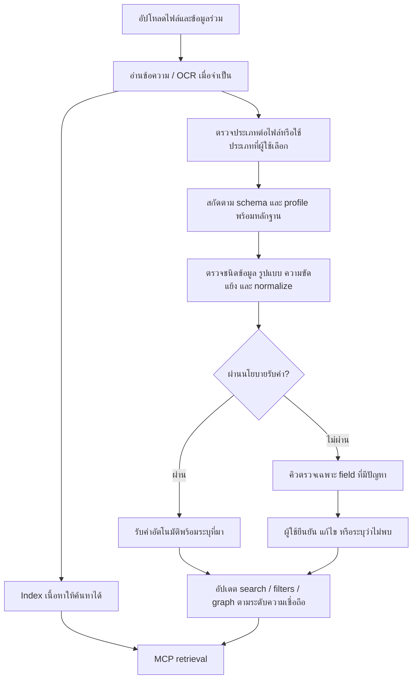

# ข้อเสนอ: อัปโหลดก่อน เติม metadata อัตโนมัติ ตรวจเฉพาะข้อยกเว้น

สถานะ: แบบออกแบบ — 8 กันยายน 2026; ดูขอบเขตที่พัฒนาแล้วและวิธีเปิดใช้ใน [Automatic metadata implementation](AUTO_METADATA_IMPLEMENTATION.md)

## เป้าหมายและข้อค้นพบ

ลดการกรอกข้อมูลต่อเอกสาร โดยใช้ Document Type เป็นสัญญาว่าระบบควรค้นหาข้อมูลอะไรจากเอกสาร และใช้ metadata ที่ตรวจสอบย้อนกลับได้ช่วย Agent ค้นหา กรอง และเชื่อมโยงข้อมูล

จากภาพ ผู้ใช้ต้องเลือกประเภทแล้วพบฟอร์มทุก field ก่อนอัปโหลด แม้เป็น optional ก็สร้างภาระให้ต้องตัดสินใจทีละช่อง ส่วนชื่อทดสอบ `rr` / `ff` ไม่บอกความหมายเพียงพอให้ AI สกัดข้อมูล จึงต้องมีคำอธิบายเชิงความหมายในขั้นตั้งค่า template ครั้งเดียว

ฐานที่มีอยู่ในโค้ด:

- `document_templates.py`: template แยกจาก processing profile, มี searchable/filterable/graph mapping และ validation ที่ปฏิเสธ required field ว่างตั้งแต่อัปโหลด
- `models.py`: เอกสารเก็บ snapshot ของ template และค่าข้อมูล; `DocumentMetadataValue` รองรับ projection สำหรับ exact filter
- `services.py`: มี legal extraction เฉพาะทาง, metadata text search, metadata filter และ metadata graph sync อยู่แล้ว แต่เส้นทาง custom metadata ที่ตรวจพบยังรับค่าจากผู้ใช้
- `schemas.py`: `QueryFilters.metadata` เป็น dictionary ของ string ยังไม่ใช่ typed range predicates
- `docs/MCP.md` และ `main.py`: มี `search_knowledge`, `document_inventory_summary`, เครื่องมือ graph และกฎหมาย; token จำกัด KB และ allowed tools

## 1. ประสบการณ์ผู้ใช้

### ตั้งค่าประเภทครั้งเดียว

ผู้ดูแลเลือก template สำเร็จรูป หรือสร้างประเภทจากชื่อและคำอธิบาย พร้อมเอกสารตัวอย่างเพื่อทดสอบการสกัดก่อนเปิดใช้งาน

แต่ละ field แสดงหลัก ๆ เพียง **ชื่อ / ชนิดข้อมูล / วิธีเติม** รายละเอียดการสกัด ตัวอย่าง alias เงื่อนไขตรวจสอบ และ graph mapping อยู่ในส่วนขยาย การเสนอ schema จากเอกสารตัวอย่างต้องให้ผู้ดูแลตรวจและบันทึกก่อนเปิดใช้

| วิธีเติม | ตัวอย่าง | พฤติกรรม |
|---|---|---|
| อ่านจากเอกสาร | เลขที่ประกาศ หน่วยงาน วันที่มีผล | สกัดพร้อมหลักฐาน ไม่พบให้เป็น unknown |
| ค่าเริ่มต้นของชุดงาน | โครงการ เจ้าของชุดข้อมูล | ผู้ใช้กำหนดครั้งเดียว ใช้เฉพาะ field ที่ระบุว่าใช้ร่วมกัน |
| ผู้ใช้ระบุ | หมวดงานภายในที่ไม่ได้อยู่ในเอกสาร | เลือกครั้งเดียวต่อ batch หรือกรอกภายหลัง |

ตัวอย่างนิยาม `effective_date`: “วันที่เอกสารระบุว่าเริ่มมีผล ไม่ใช่วันที่ลงนามหรือเผยแพร่; เก็บ ISO date และข้อความต้นฉบับ; ถ้าเป็นเงื่อนไขให้อ้างข้อความเงื่อนไขและยังไม่ยืนยันวันที่”

แยกเงื่อนไขเดิม Required เป็น `optional` / `required_for_verified_metadata` / `required_at_upload` โดยตัวสุดท้ายใช้เฉพาะค่าที่ผู้ใช้ต้องให้ก่อนรับไฟล์จริง ไม่บังคับค่าที่ระบบตั้งใจอ่านภายหลัง

### อัปโหลดหลายไฟล์

หน้าหลักของ drawer มีเพียงพื้นที่เลือกไฟล์ ประเภทเอกสาร และปุ่ม **อัปโหลด**:

```text
เพิ่มเอกสาร                              ×
┌───────────────────────────────────────┐
│ วางไฟล์ที่นี่ หรือ เลือกไฟล์            │
└───────────────────────────────────────┘
ประเภทเอกสาร  [ตรวจจับอัตโนมัติ       ▾]
▸ ข้อมูลร่วมของชุดนี้
                              [อัปโหลด]
```

- ตรวจจับประเภทแยกต่อไฟล์ รองรับ batch ที่มีหลายประเภท; ผู้ใช้เลือกบังคับประเภททั้งชุดหรือรายไฟล์ได้
- ส่วนข้อมูลร่วมปิดไว้ก่อน แสดงเฉพาะ field ที่อนุญาต batch default; เลขเอกสารและวันที่เฉพาะฉบับไม่ควรถูกคัดลอกทั้งชุดโดยปริยาย
- ไม่ต้องรอ AI ใน drawer งานทำต่อเบื้องหลังและแสดงสถานะรายไฟล์
- แยกสถานะ **พร้อมค้นหา** กับ **ข้อมูลประกอบครบ/รอตรวจ/เติมไม่สำเร็จ**; metadata ล้มเหลวไม่ทำให้เนื้อหาที่ index สำเร็จหายจากการค้นหา
- ประเภทไม่ชัดเจนให้ใช้เส้นทางอ่านเนื้อหาทั่วไปและส่งเข้าคิวตรวจประเภท ก่อนรัน profile เฉพาะทางอีกครั้ง

### ตรวจเฉพาะรายการที่ต้องตัดสินใจ

Library เพิ่มตัวกรอง “ต้องตรวจ” และ badge สั้น ๆ เช่น “วันที่ไม่ชัดเจน” เปิดแล้วเป็นพื้นที่กว้างสองฝั่ง: ต้นฉบับพร้อมตำแหน่งหลักฐาน และเฉพาะ field ที่มีปัญหา

มีปุ่ม **ยืนยัน / แก้ไข / ไม่พบในเอกสาร**; รองรับเลือกหลายรายการเพื่อใช้ค่าเดียวเมื่อเห็นรายการเป้าหมายชัดเจน บนมือถือสลับแท็บ “ข้อมูล / หลักฐาน” แทนบีบสองคอลัมน์ ช่องป้อนข้อมูลมี label ถาวร ปุ่ม icon มี accessible name และ tooltip

ข้อมูลอื่นเก็บในส่วน “ข้อมูลทั้งหมด” ไม่แสดงฟอร์มเต็มเป็นค่าเริ่มต้น การแสดง confidence ใช้สถานะที่เข้าใจได้; คะแนนดิบและรายละเอียดโมเดลอยู่ในส่วนขยาย

## 2. Processing และความน่าเชื่อถือ



1. เก็บข้อความที่อ่านได้และ content version ใช้ซ้ำกับ classification, extraction และ indexing; OCR เฉพาะเมื่อมีความสามารถรองรับและจำเป็น
2. ใช้ parser/rule และผล legal extraction เดิมก่อน จากนั้นใช้ structured extraction กับ custom fields ที่ยังขาด ไม่สกัดค่าซ้ำด้วยหลายระบบโดยไม่มี reconciliation
3. ทุกค่าจากเอกสารต้องมี evidence ที่ตรวจสอบตำแหน่งได้: page ถ้ามี, chunk/character offsets และ excerpt ผูก content version; ถ้าไม่มี page ให้แสดงตำแหน่งข้อความจริง ไม่สร้างเลขหน้า
4. ตรวจวันที่ เลขไทย/อารบิก พ.ศ./ค.ศ. enum และ alias โดยคงค่าต้นฉบับ; วันที่กำกวมไม่แปลงเงียบ ๆ และไม่แทน unknown ด้วย false/0
5. ค่า override ที่ผู้ใช้ยืนยันและล็อกต้องไม่ถูก AI เขียนทับ; ผลสกัดใหม่เป็น candidate การขัดกันกับค่า batch default ต้องให้เห็น ไม่ถือว่า default เป็นข้อเท็จจริงจากเอกสาร
6. จัดระดับ `suggested`, `auto_accepted`, `human_verified`, `rejected`; แยกสถานะการสกัด `pending`, `not_found`, `conflict`, `failed` ออกจากระดับความเชื่อถือและจาก document processing status
7. การรับค่าอัตโนมัติพิจารณาหลักฐาน validation และผลประเมินราย field ไม่ใช้คะแนนความมั่นใจที่โมเดลให้ตัวเองเพียงอย่างเดียว ข้อมูลผลใช้บังคับ/การยกเลิกกฎหมายยังยึด review policy ของ legal registry
8. metadata graph เดิมมีเส้นทางที่กำหนด verified/confidence=1.0 จึงห้ามส่งค่า AI เข้าเส้นทางเดิมโดยไม่แก้ trust propagation ก่อน; edge ต้องอ้าง field/evidence และใช้ระดับความเชื่อถือจริง
9. เนื้อหาเอกสารเป็นข้อมูลสำหรับสกัด ไม่ใช่คำสั่งให้เปลี่ยน schema เรียกเครื่องมือ หรือขยายสิทธิ์ ค่าต้องผ่าน schema ฝั่ง server

## 3. Data model และงานเบื้องหลังที่เสนอ

เพิ่ม field definition: `fill_mode`, `extraction_description`, `examples`, `aliases`, `requirement`, `normalization`, `review_policy`, `batch_default_allowed` และ optional `semantic_concept` เพื่อเชื่อม field ความหมายเดียวกันข้ามประเภท

ใช้ field identity ประกอบ template identity/version ป้องกัน key เดียวกันแต่คนละความหมาย อย่ารวมตาม label อย่างเดียว การแสดงชื่อใหม่ไม่เปลี่ยน identity ของ field ที่ใช้งานแล้ว

เพิ่ม per-field observations แยกจาก `document_metadata` ซึ่งคงเป็น effective values เพื่อรองรับ client เดิม:

```text
document_id, field_identity, raw_value, normalized_value, value_type
origin: document_extraction | batch_default | manual
trust_status, extraction_status, evidence[], confidence_signals
template_version, content_version, extractor_version
reviewed_by, reviewed_at, locked, observation_revision
```

เพิ่มงาน `EXTRACT_DOCUMENT_METADATA` ที่ retry แยกจากอ่านไฟล์/embedding โดยใช้ idempotency จาก document + content + template + extractor version และ optimistic concurrency กันงานเก่าเขียนทับการแก้ไขล่าสุด Cache ข้อความและผลสกัดตามเวอร์ชัน จำกัด concurrency/cost และสกัดเฉพาะ field ที่เปลี่ยนเมื่อทำได้

อัปเดต effective values และ local projections ใน transaction เดียว; ระบบ index/graph ภายนอกใช้งาน outbox พร้อม revision และ retry การแก้ค่าต้องล้าง projection ของค่าเก่า และก่อนใช้ผล remote ต้องตรวจสิทธิ์/สถานะ/เวอร์ชันกับข้อมูลปัจจุบัน

## 4. MCP: ลดงานกรอกโดยไม่ลด recall

### ต่อเครื่องมือเดิมเป็นหลัก

| เครื่องมือ | ส่วนต่อยอดที่เสนอ |
|---|---|
| `search_knowledge` | คง query ต้นฉบับ เพิ่ม typed metadata predicates และคืน matched fields, provenance, trust, applied filters |
| `document_inventory_summary` | สรุปตาม field ที่รองรับ พร้อมจำนวน unknown/pending และขอบเขตการนับ ไม่ให้ Agent นับจาก chunks |
| `get_sources` | เพิ่ม evidence ของ metadata ที่ประกอบคำตอบพร้อม source version |
| เครื่องมือ graph/กฎหมายเดิม | ใช้ trust และ legal review policy อย่างสอดคล้อง ไม่ยกระดับ suggested เป็น verified |
| `describe_knowledge_schema` (ใหม่) | บอกประเภท field identity/ความหมาย ชนิดข้อมูล operators aliases และ coverage ภายในขอบเขต token |

ไม่ต้องสร้าง MCP tool ต่อ document type หรือ field; type ใหม่ใช้ schema discovery เดิมได้ Token เดิมไม่เพิ่มสิทธิ์ tool ใหม่อัตโนมัติ และยังใช้ search เดิมได้หากไม่มีสิทธิ์ discovery

### สองรูปแบบการใช้ metadata

- **เงื่อนไขที่ผู้ใช้ระบุชัด** เช่น “เฉพาะกรมที่ดิน ปี 2567”: ใช้ validated typed filters กับ effective values ที่ policy ยอมรับ ต้องมีข้อมูล coverage และรายการที่ยังประเมินเงื่อนไขไม่ได้แยกจากผลตรงเงื่อนไข ไม่แอบคลาย filter เมื่อผลเป็นศูนย์
- **สัญญาณที่ระบบอนุมาน** เช่นคาดว่าคำถามเกี่ยวกับประกาศ: ใช้เพิ่มอันดับร่วมกับ semantic/keyword retrieval ห้ามใช้เป็น hard filter ที่ตัดเอกสาร metadata ว่างหรือจำแนกผิด

ค้นหาเนื้อหาและ metadata ควบคู่กัน รวมผลและ rerank; ใช้ alias/canonical organization identity เพื่อให้คำเรียกต่างกันจับคู่ได้ โดยการรวม entity ต้องมีหลักฐาน ไม่ใช้ความคล้ายของชื่อเพียงอย่างเดียว

รองรับ eq/in สำหรับ enum/text และ range สำหรับ date/number ผ่าน typed storage/index; เปรียบเทียบวันที่และตัวเลขตามชนิดจริง ไม่ใช้ string range เพิ่ม predicates แบบมีเวอร์ชันโดยคง `filters.metadata` เดิมสำหรับ client เก่า

Schema discovery ต้องอ้างอิง field version ที่ยังมีอยู่ในเอกสาร รวมประเภทที่เลิกใช้แต่ยังมีข้อมูล และคืนเฉพาะข้อมูล/coverage ที่ token มีสิทธิ์เห็น สิทธิ์ KB การลบเอกสาร และ legal temporal policy ใช้กับทุก retrieval channel, facets, counts และ evidence

ตัวอย่างคำถาม “ประกาศกรมที่ดินที่มีผลปี 2567”: resolve issuer alias → ช่วงวันที่ normalized → ค้นเนื้อหาและ metadata → ตรวจหลักฐานและสถานะกฎหมาย → ส่ง citation พร้อมวันที่และแหล่งที่มา ถ้า field วันที่ของบางเอกสารยัง unknown ต้องบอกขอบเขตความครบถ้วน ไม่สรุปว่าไม่มีเอกสารอื่น

## 5. ลำดับส่งมอบ

1. **Upload และ custom extraction ก่อน**: เลือกประเภทครั้งเดียว, ซ่อน optional form ในส่วนขยาย, แยก required หลัง extraction, เพิ่ม job/provenance/review queue และรักษา manual overrides ใช้ประเภทที่ผู้ใช้เลือกในรุ่นแรกเพื่อลดความซับซ้อน
2. **MCP และ index**: typed filters, schema discovery, trust-aware graph/search, evidence, coverage และ consistency หลังแก้ค่า
3. **Auto classification และ bulk enrichment**: mixed-type upload, template suggestions, backfill เอกสารเดิม, cache และปรับ thresholds จากผลประเมิน

ข้อมูลเดิมคง provenance เป็น legacy/manual ตามที่ตรวจสอบได้ ไม่แต่งหลักฐานย้อนหลัง; template เดิมคง requirement semantics จนผู้ดูแลเปลี่ยนหรือ migrate อย่างชัดเจน Snapshot เดิมไม่เปลี่ยนตาม template ใหม่ทันที การ backfill ต้องเลือกเป้าหมาย/เวอร์ชันและไม่เขียนทับค่าที่ล็อก

## 6. เกณฑ์รับงาน

วัดเทียบ baseline ที่ใช้งานปัจจุบันด้วยชุดเอกสารที่มีคำตอบอ้างอิง ทั้งเอกสารไทย สแกน วันที่กำกวม หลายประเภท และ custom field:

- เวลาและจำนวนช่องที่ผู้ใช้ต้องกรอกต่อ 100 เอกสารลดลง; เป้าหมายตั้งต้นลด manual edits อย่างน้อย 80% บนชุดทดสอบที่ตกลงกัน ไม่ใช่ผลที่พิสูจน์แล้ว
- วัด precision/recall ต่อ field, อัตรา auto acceptance ที่ผิด, อัตราต้องตรวจ และเวลาประมวลผล/ค่าใช้จ่ายต่อเอกสาร
- Retrieval Recall@20 และ citation correctness ไม่ต่ำกว่า baseline; เพิ่มชุดคำถาม exact filters, alias, unknown metadata และประวัติกฎหมาย
- ทดลอง AI ไม่ตอบ, OCR ผิด, สกัดไม่ได้ และ classification ผิด: เนื้อหาที่พร้อมยังค้นได้ และสถานะ metadata ไม่รายงานสำเร็จเท็จ
- ยืนยันแก้ค่าระหว่างงานกำลังรันแล้วไม่ถูกเขียนทับ; retry ไม่สร้าง observation/graph ซ้ำ; ค้นไม่เจอค่าเก่าหลัง projection sync สำเร็จ
- ทดสอบ batch ต่างประเภทและ field key ชนกันข้าม template; date range ไม่เทียบเป็นข้อความ
- ตรวจสิทธิ์ทุก tool/channel/count/evidence รวม token ไม่มี discovery permission; ไม่มีข้อมูลข้าม KB รั่ว
- ทดสอบ desktop/mobile, keyboard, label, overflow และพื้นที่อ่านหลักฐานจริง

ไฟล์นี้เป็นแบบกระบวนการและข้อกำหนด ขอบเขตที่พัฒนาแล้วระบุใน [Automatic metadata implementation](AUTO_METADATA_IMPLEMENTATION.md); ยังไม่ได้ยืนยันผล benchmark เทียบ baseline
