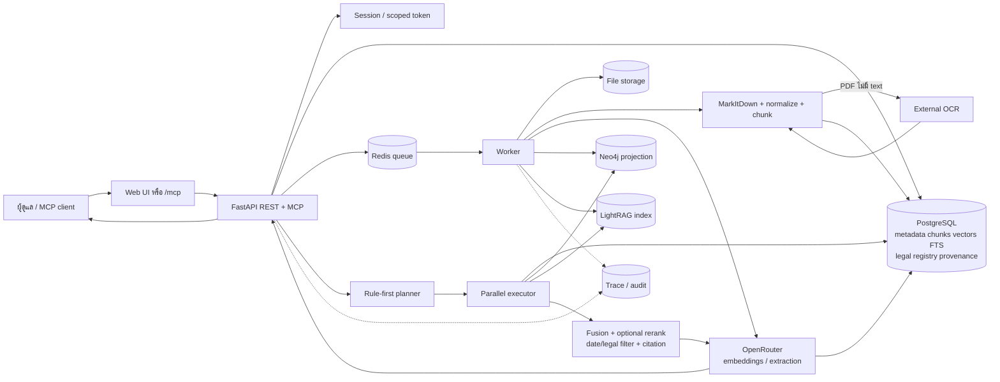

# High-level Data Flow

ไดอะแกรมนี้สรุปการไหลของข้อมูลตั้งแต่ upload จนถึงคำตอบที่มี citation โดย PostgreSQL เป็นแหล่งข้อมูลหลัก ส่วน Neo4j และ LightRAG เป็นดัชนี/ตัวช่วย retrieval

## ลำดับหลัก

1. **Upload** — ตรวจสิทธิ์, MIME, ขนาด, checksum และบันทึกไฟล์ต้นฉบับพร้อม job
2. **Process** — worker แปลงเป็น Markdown, chunk, embed และสร้าง metadata/graph
3. **Index** — PostgreSQL เก็บ evidence และ citation; Neo4j/LightRAG รับ projection เสริม
4. **Plan** — planner เลือก channel ตามรูปแบบคำถามและ policy; LLM ใช้เฉพาะ fallback ที่จำเป็น
5. **Retrieve** — executor ค้น Vector, Full-text, Exact, Graph และ LightRAG แบบขนาน พร้อมกรอง KB, entity และวันที่
6. **Answer** — รวมอันดับ, rerank ตาม policy, ตรวจ legal validity และส่งเฉพาะ evidence ที่อ้างอิงได้ให้ LLM
7. **Respond** — REST/MCP ได้ summary, structured result, citations, retrieval plan/trace และ request ID

## ขอบเขตข้อมูล

| แหล่งข้อมูล | เป็นเจ้าของอะไร |
|---|---|
| File volume | ไฟล์ต้นฉบับ |
| PostgreSQL | metadata, chunks, vectors, FTS, provenance, jobs, legal registry, audit และ traces |
| Neo4j | graph projection และ traversal แบบจำกัดขอบเขต |
| LightRAG | semantic/graph retrieval เสริม |
| Redis | queue และ runtime coordination |
| OpenRouter | embedding/LLM ภายนอก รับข้อมูลที่ผ่าน authorization และ evidence filtering แล้ว |
