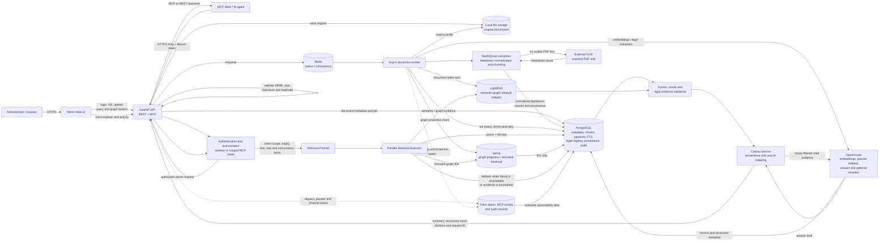

# High-level Data Flow Diagram

This diagram describes the production MVP flow from document ingestion to a
cited answer returned through the REST API or Remote MCP. PostgreSQL is the
canonical source for evidence and provenance; Neo4j is a bounded graph
accelerator and projection, not the citation authority.

## Flow summary

1. **Ingestion** — the API authenticates the administrator, validates the
   upload, stores the original file, and creates a durable processing job.
2. **Extraction** — the worker converts the local file to canonical Markdown
   with MarkItDown. Scanned PDFs can use the configured external OCR service;
   otherwise they remain `OCR_REQUIRED`.
3. **Indexing** — PostgreSQL receives chunks, embeddings, full-text data,
   legal metadata, and provenance. Neo4j and LightRAG receive projections or
   adapter-specific indexes asynchronously.
4. **Authorization** — every query is checked against the session or MCP token.
   MCP token scope is authoritative; a client cannot broaden its Knowledge Base
   scope by sending extra IDs.
5. **Retrieval** — the planner selects permitted channels. Vector, FTS, graph,
   and LightRAG channels can execute in parallel. Neo4j returns bounded IDs;
   PostgreSQL resolves the evidence and citations. PostgreSQL traversal is the
   fallback when the projection is unavailable or stale.
6. **Answering** — results are fused, optionally reranked, filtered for legal
   version/status rules, and mapped to source citations before an answer is
   generated.
7. **Observability** — API and worker spans record the request, plan, actual
   route, fallbacks, durations, result counts, and errors without storing token
   secrets or authorization headers.

## Data ownership boundaries

| Component | Responsibility | Authority |
|---|---|---|
| File storage | Original uploaded files | Source artifact |
| PostgreSQL | Metadata, chunks, vectors, FTS, legal registry, provenance, audit | Canonical system of record |
| Neo4j | Projected entities/relationships and bounded traversal | Retrieval accelerator |
| LightRAG | Adapter-managed semantic/graph retrieval index | Retrieval supplement |
| OpenRouter | Embedding, constrained planner fallback, rerank/answer generation | External processing dependency |
| Redis | Queue and runtime coordination | Ephemeral/durable job coordination |
